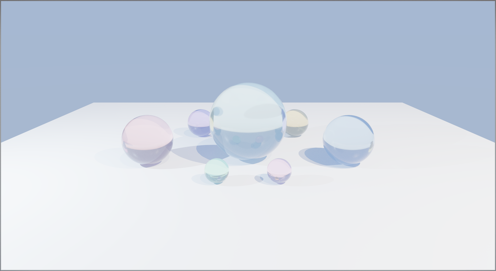

# RustVK

A Vulkan renderer written in Rust. Uses raw [`ash`](https://github.com/ash-rs/ash) bindings with no high-level graphics abstraction on top. Every Vulkan object is owned by a typed Rust struct and cleaned up through `Drop`.

Right now it renders a lit rotating cube with Blinn-Phong shading, 4x MSAA, and a point light. The plan is to keep building on top of this foundation.

---

## Preview



---

## What it does

- Renders with raw Vulkan, no wgpu or vulkano
- Blinn-Phong lighting with quadratic point-light attenuation
- 4x MSAA with a 3-attachment render pass (MSAA color, MSAA depth, resolve)
- 2 frames in flight, per-frame command buffers and uniform buffers
- Geometry uploaded to DEVICE_LOCAL memory via staging buffers
- GLSL shaders compiled to SPIR-V at build time by `build.rs` using `glslc`
- Swapchain recreated on resize
- Validation layers enabled automatically in debug builds

One thing worth noting: `render_finished` semaphores are indexed by swapchain image index, not by frame. The presentation engine holds a semaphore until that image slot is released back to the app, so indexing by frame causes `VUID-vkQueueSubmit-pSignalSemaphores-00067` and GPU faults once the swapchain has more images than frames in flight.

---

## Requirements

- Rust stable (1.78+)
- Vulkan 1.2+
- `glslc` on PATH, from the [LunarG Vulkan SDK](https://vulkan.lunarg.com/)
- `VK_LAYER_KHRONOS_validation` for debug output (also from the SDK, optional)

Platform notes:

- Linux (Wayland): tested on KDE Plasma with NVIDIA driver 595.x. Present mode is hardcoded to FIFO because MAILBOX triggers a `wp_tearing_control_v1` protocol conflict on some NVIDIA/compositor combinations.
- Linux (X11) and Windows: should work fine.
- macOS: not tested, would need MoltenVK.

---

## Build & Run

```bash
git clone https://github.com/CanReader/RustVK.git
cd RustVK

cargo run            # debug, validation layers on
cargo run --release  # release, LTO enabled

RUST_LOG=debug cargo run  # verbose output
```

Pre-compiled `.spv` files are checked in so you can build without the Vulkan SDK. If `glslc` is on PATH, `build.rs` will recompile them automatically.

---

## Project structure

```
src/
├── main.rs                  # event loop, cube rotation, resize
├── scene/
│   └── mod.rs               # Vertex, Camera, Light, UniformBufferObject, Scene
├── shaders/
│   ├── shader.vert
│   └── shader.frag
└── renderer/
    ├── mod.rs               # VulkanRenderer, owns everything
    ├── instance.rs          # instance + debug messenger
    ├── device.rs            # physical/logical device, queue families
    ├── swapchain.rs         # swapchain, image views
    ├── msaa.rs              # MSAA color image
    ├── depth.rs             # depth image
    ├── render_pass.rs       # render pass with MSAA resolve
    ├── framebuffer.rs       # framebuffers
    ├── pipeline.rs          # graphics pipeline
    ├── descriptor.rs        # descriptor pool, layout, per-frame sets
    ├── buffer.rs            # vertex, index, uniform buffers + staging
    ├── command.rs           # command pool, one-shot commands
    └── sync.rs              # semaphores and fences
```

Destruction order matters in Vulkan. Rust drops struct fields in declaration order, so `VulkanRenderer` is laid out so that device-level resources drop before the logical device, the surface drops after the device, and the instance drops last.

---

## Rendering pipeline

```
Vertex + Index buffers (DEVICE_LOCAL)
            |
            v
      Vertex shader
      MVP transform
      Normal matrix (transpose(inverse(model)))
            |
            v
      Fragment shader
      attenuation = 1 / (1 + 0.045*d + 0.0075*d^2)
      color = (ambient + diffuse*atten + specular*atten) * albedo
            |
            v
      4x MSAA color + depth
            |
            v
      Resolve to swapchain image (1x)
            |
            v
      vkQueuePresentKHR
```

Uniform buffer layout:

```glsl
layout(binding = 0) uniform UBO {
    mat4 model;       // cube rotation (Y + slight X tilt)
    mat4 view;        // fixed camera at (0, 2, 5)
    mat4 proj;        // 45 deg FOV, Y flipped for Vulkan NDC
    vec3 lightPos;
    vec3 lightColor;  // warm white
    vec3 viewPos;
};
```

---

## What's next

**Geometry & assets**
- [ ] glTF model loading
- [ ] Texture loading (diffuse, normal, roughness maps)
- [ ] Mip map generation
- [ ] Instanced rendering
- [ ] Skybox / cubemap

**Lighting & shading**
- [ ] PBR (metallic-roughness workflow)
- [ ] Image-based lighting (IBL)
- [ ] Multiple point lights
- [ ] Directional light
- [ ] Normal mapping
- [ ] Gamma correction + HDR tone mapping

**Shadows**
- [ ] Basic shadow mapping
- [ ] Cascaded shadow maps (CSM)
- [ ] Percentage-closer filtering (PCF)

**Post-processing**
- [ ] Bloom
- [ ] SSAO (screen-space ambient occlusion)
- [ ] TAA (temporal anti-aliasing)
- [ ] Motion blur

**Architecture**
- [ ] Render graph
- [ ] Bindless textures
- [ ] GPU-driven rendering (indirect draw)
- [ ] Compute shaders
- [ ] Ray tracing (VK_KHR_ray_tracing)

**Developer tools**
- [ ] ImGui integration
- [ ] RenderDoc markers
- [ ] GPU timestamps / frame profiling

---

## Dependencies

| Crate | Version | Purpose |
|---|---|---|
| [ash](https://crates.io/crates/ash) | 0.38 | Vulkan bindings |
| [winit](https://crates.io/crates/winit) | 0.30 | Windowing |
| [ash-window](https://crates.io/crates/ash-window) | 0.13 | Vulkan surface creation |
| [raw-window-handle](https://crates.io/crates/raw-window-handle) | 0.6 | Platform window handles |
| [cgmath](https://crates.io/crates/cgmath) | 0.18 | Math |
| [bytemuck](https://crates.io/crates/bytemuck) | 1 | Zero-copy GPU data casting |
| [log](https://crates.io/crates/log) + [env_logger](https://crates.io/crates/env_logger) | 0.4 / 0.11 | Logging |

---

## License

MIT. See [LICENSE](LICENSE).
